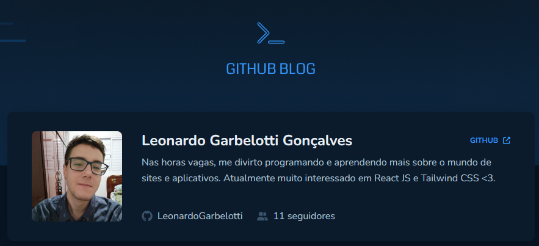
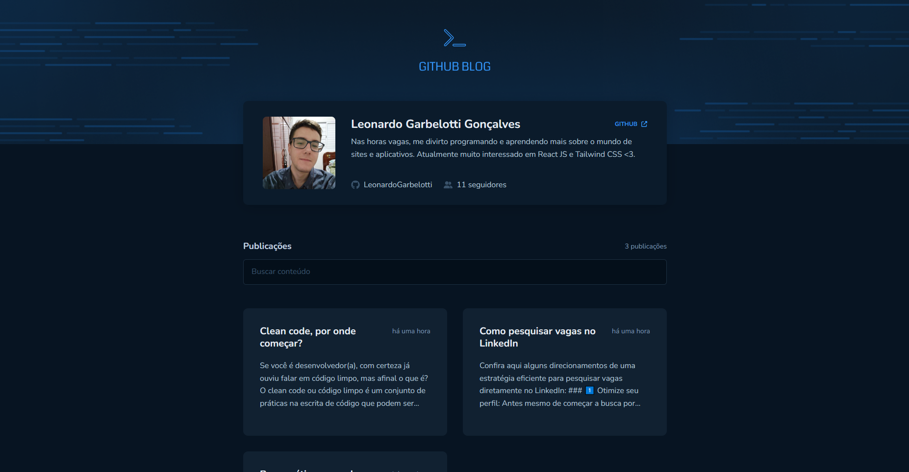
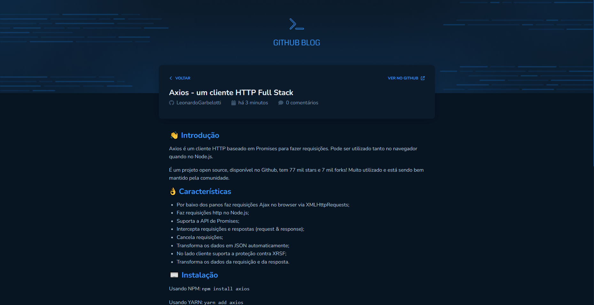

# Github Blog

O Github blog é um desafio proposto no 3º módulo da trilha React da RocketSeat. A aplicação consiste em um blog utilizando a API do Github para buscar Issues de um repositório.

## 🛠️ Nesse projeto foi utilizado
* Vite
* Styled Components
* Typescript
* React Router Dom
* React Hook Form
* Axios
* API do Github

## 📷 Screenshots
Imagens da aplicação

### Página Inicial

### Página conteúdo do Post

